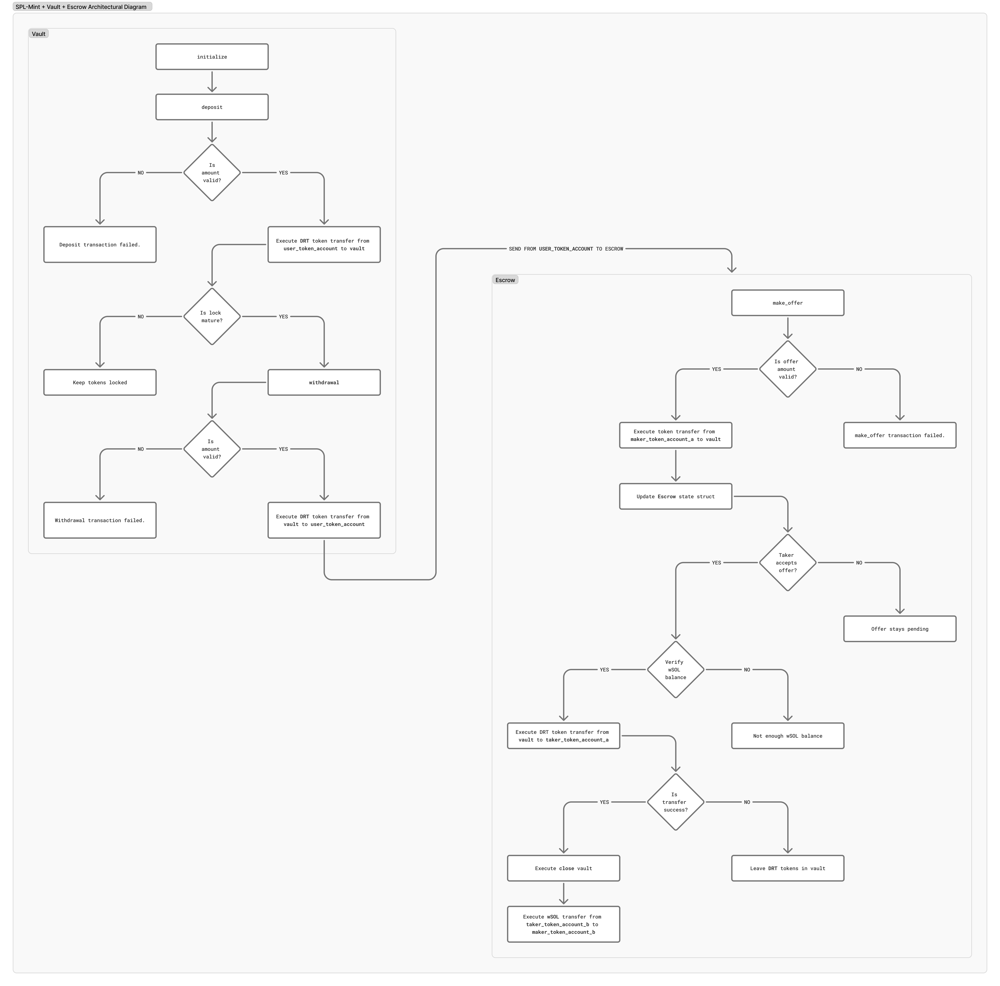

# 🤝 Mogimis

## What is this?

Mogimis is a personal vault that helps you accumulate DRT tokens until you reach your target amount, then converts them all to SOL in one transaction - saving you from paying multiple conversion fees.

## The Problem

You receive DRT tokens regularly (from payments, rewards, trading, etc.). Every time you convert DRT to SOL, you pay transaction fees. Converting frequently means paying fees repeatedly, which adds up quickly.

## The Solution

Save your DRT in your personal vault until you reach your target amount, then convert everything at once. Pay fees only once instead of multiple times.

## User Story

**Meet James**

James receives DRT tokens for his freelance work - sometimes 50 DRT, sometimes 120 DRT, sometimes 80 DRT throughout the month.

If James converts to SOL after each payment, he pays $5 in transaction fees every time. After 10 payments, that's $50 just in fees.

Instead, James creates a personal vault and sets a target of 1,000 DRT. Each time he receives DRT, he deposits it into his vault. When he reaches 1,000 DRT, the vault releases the funds. James then moves them to the escrow which converts everything to SOL in one transaction.

**Result:** James pays $5 once instead of $50 multiple times, saving $45.

## Architectural Diagram


_Architectural diagram of interaction between Vault and Escrow_

## How It Works

```
STEP 1: CREATE YOUR VAULT
Set your target amount (e.g., 1,000 DRT)

STEP 2: SAVE YOUR DRT
Deposit DRT into your vault as you receive it
Progress: 100 → 250 → 500 → 850 → 1,000 ✓

STEP 3: TARGET REACHED
Vault releases funds to your account

STEP 4: MOVE TO ESCROW
Transfer your DRT to escrow for conversion

STEP 5: CONVERT
Escrow converts DRT → SOL in one transaction

STEP 6: RECEIVE SOL
SOL arrives in your wallet
```

## Visual Overview

```
    YOU RECEIVE DRT          YOUR VAULT           YOUR ACCOUNT          ESCROW              YOUR WALLET
                                                                                        
💰 +50 DRT              ┌─────────────┐       ┌─────────────┐      ┌─────────────┐    ┌─────────────┐
💰 +120 DRT   ────────> │   VAULT     │ ───>  │  ACCOUNT    │ ───> │   ESCROW    │ ───> │   WALLET    │
💰 +80 DRT              │             │       │             │      │             │    │             │
                        │ Target: 1000│       │ Balance:    │      │ Converting: │    │ Received:   │
                        │ Saved:  1000│       │ 1,000 DRT   │      │ DRT → SOL   │    │ 85 SOL      │
                        │ Status: ✓   │       │             │      │             │    │             │
                        └─────────────┘       └─────────────┘      └─────────────┘    └─────────────┘
                        
                        Accumulate              Target              Conversion          Complete
                        until target            reached             in progress
```

## Cost Comparison

**Without Vault (10 conversions)**

- Convert 100 DRT × 10 times
- Fee: $5 × 10 = **$50 total**

**With Vault (1 conversion)**

- Save 1,000 DRT, convert once
- Fee: $5 × 1 = **$5 total**

**Savings: $45 (90% reduction)**

## Benefits

- **Lower Fees**: Pay transaction fees once instead of multiple times
- **Savings Discipline**: Set a target and accumulate toward it
- **Secure Storage**: Your DRT is safely stored until you're ready to convert
- **Convenience**: Deposit when you receive, convert when ready
- **Better Planning**: Know exactly when you'll convert based on your target

## How Escrow Works

The escrow handles the actual conversion from DRT to SOL:

- **Maker (You)**: Provide DRT for conversion
- **Taker (SOL)**: Receive SOL after conversion
- **Cancellation**: You can cancel and get your DRT refunded before conversion completes
- **Security**: Smart contract ensures safe, automated processing

## Example Scenarios

**Freelancer**

- Receives 50-200 DRT per project
- Target: 1,000 DRT
- Time: 2 months
- Savings: $35 in fees

**Staking Rewards**

- Earns 20 DRT daily
- Target: 600 DRT
- Time: 30 days
- Savings: $145 per month

**Trading**

- 5-10 trades per week
- Target: 2,000 DRT
- Time: 3 weeks
- Savings: $120

## Technical Components

**Vault**

- Stores your DRT tokens
- Tracks target and current balance
- Releases funds when target is reached

**Escrow**

- Receives DRT for conversion
- Executes DRT → SOL swap
- Sends SOL to your wallet
- Allows refund if cancelled

## Getting Started

1. Create your vault and set a target amount
2. Deposit DRT as you receive it
3. Wait for vault to reach target
4. Move funds to escrow
5. Receive SOL

## FAQ

**Can I withdraw before reaching my target?**
Not currently. DRT stays in vault until target is reached.

**What if I need my funds urgently?**
You can cancel the escrow conversion and get your DRT back before conversion completes.

**How long does conversion take?**
Usually within minutes once funds are in escrow.

**Can I change my target?**
No, the target is set when you create your vault.

---

_Built with security from Aegis, accounting from Moneta, and governance from Themis._
