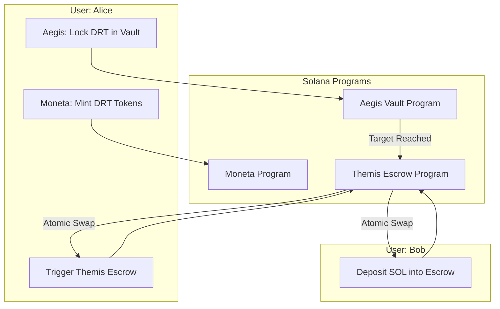

# 💱 Themis · Trustless Token Conversion System on Solana Devnet

**Themis** is a trustless token conversion system built on the **Solana Devnet**, combining three key programs — **Moneta**, **Aegis**, and **Themis** — to demonstrate a secure, automated exchange mechanism between users once specific token conditions are met.

Inspired by _Themis_, the Greek goddess of justice and fairness, this project showcases how decentralized logic can replace trust in financial interactions.

---

## 🌐 Overview

The system enables a user to **convert DRT tokens to SOL** only when a **target amount of DRT** has been accumulated in a vault.  
Instead of performing multiple small, costly swaps, users **lock their DRT tokens** until the threshold is reached, then **trigger an escrow-based exchange** for SOL in one atomic transaction.

This workflow reduces transaction fees, improves security, and demonstrates the power of composable Solana programs.

---

## 🧩 Components

### 🪙 **Moneta**

A lightweight toolkit for creating and managing **SPL tokens** (like DRT) on the Solana Devnet.  
It lets users:

- Create token mints
- Add token metadata
- Mint tokens to wallets

Named after _Moneta_, the Roman goddess of money and mints, it simplifies token experimentation and learning.

---

### 🛡️ **Aegis**

A secure **token vault system** that stores DRT tokens toward a defined **target amount**.  
Once the vault’s target balance is reached, it signals readiness for conversion.

Named after _Aegis_, the protective shield of Zeus, it ensures token safety while tracking deposit progress.

---

### ⚖️ **Themis (Escrow Program)**

A trustless **escrow mechanism** that allows two parties to safely exchange tokens (e.g., DRT ↔ SOL) without intermediaries.  
It leverages:

- **PDAs (Program-Derived Addresses)** for vault management
- **ATAs (Associated Token Accounts)** for secure ownership and transfers

Once both conditions are met (vault full + SOL available), the exchange executes atomically — ensuring fairness and reliability.

---

## 🧠 User Story: "The Single-Swap Saver"

**Alice** wants to convert her **DRT tokens** to **SOL**, but frequent swaps on Solana cost her too much in transaction fees.  
Instead, she decides to:

1. **Lock her DRT tokens** into an **Aegis vault** until she reaches a target amount (say, 1,000 DRT).
2. Once the vault is full, **Themis** automatically initializes an **escrow** to exchange the DRT for SOL with another user (**Bob**) who deposits SOL into the escrow.
3. When both sides have funded their parts, **Themis** executes the **atomic swap** — transferring SOL to Alice and DRT to Bob.

No middlemen. No partial transfers. No trust required.  
Just **pure, programmatic fairness** — the essence of Themis.

---

## 🏗️ System Architecture

